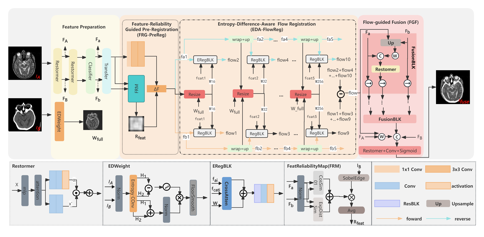

# EDARFusion
Unaligned multimodal medical image fusion faces dual challenges of spatial misalignment and cross-modal information inconsistency. Existing collaborative registration–fusion frameworks often enforce global alignment, causing unreliable regions such as low-texture areas and noise to severely interfere with deformation estimation; they are also prone to inducing erroneous deformations and ghosting in regions with large modality discrepancies. To address these challenges, from the perspective of distinctly handling anatomical misalignment that should be aligned and modality-specific differences that should be preserved, we propose EDARFusion: Entropy-Difference-Aware Dynamic Registration for Unaligned Multimodal Medical Image Fusion. Specifically, the Feature-Reliability Guided Pre-Registration Adapter (FRG-PreReg) predicts a feature-level reliability prior map to suppress the interference of unreliable regions in deformation learning; the Entropy-Difference-Aware Flow Registration (EDA-FlowReg) generates a gating-weight map from local information entropy differences and imposes soft constraints on incremental deformation updates in multi-scale estimation, thereby enabling discrepancy-aware dynamic alignment and reducing ghosting and fusion artifacts caused by misregistration; in the fusion stage, an alignment-consistency constraint is introduced to dynamically integrate structural and modality-specific information on the basis of reliability-aware alignment. Extensive experiments and visualizations of the local information entropy-difference map, the gating-weight map, and the reliability map demonstrate that the proposed method achieves superior registration and fusion performance compared with multiple representative approaches, with interpretable decision-making.



## Main Reference Environment
1. Linux         (NVIDIA GeForce RTX 4060)
2. Python        (3.9.0)
3. torch         (2.1.0 + cuda12.1)
5. kornia        (0.7.0)
6. pandas        (2.1.1)
7. numpy         (1.24.3)
8. scipy         (1.11.3)
9. monai         (1.3.0)
10. cv2          (4.8.1)
11. PIL          (10.0.1)

## Usage


1. Data Preparation

    Download datasets form: http://www.med.harvard.edu/aanlib/

    All images are normalized to [0,1].


2. Train:

    make a csv file use your data
     ```
    python /data/make_csv.py
    ```
     
    start training
     ```
    python EDARFusion_train.py
    ```

3. Test:

    run test code:
     ```
    python EDARFusion_test_val.py
    ```
